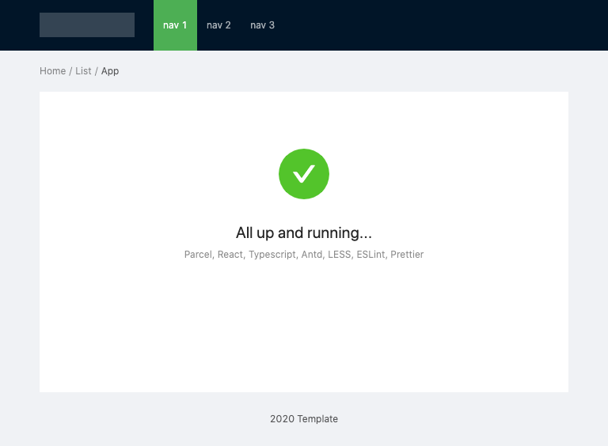

# React, Typescript and Ant Design template

A base/template repo for creating a React app with Typescript and using the Ant Design react component library.



## Libraries

- React
- Typescript
- [Ant Design](https://ant.design/components/overview/) imported styles through [LESS](http://lesscss.org/) to enable [customisation of styles](http://lesscss.org/).
- [Parcel JS](https://parceljs.org/getting_started.html) including LESS Loader
- [ES Lint](https://eslint.org/), [Prettier](https://prettier.io/) and the relevant config to enable linting and formatting to AirBnB standards.
- [Husky](https://github.com/typicode/husky) and [Lint Staged](https://github.com/okonet/lint-staged#readme) for ensuring lint and format before code-commit.

N.B. This repo uses [YARN](https://yarnpkg.com/) as the package manager

## Usage

### Start

Will start the parcel dev server with HMR and open the browser.

```sh
yarn start
```

### Build

Compiles the code for production

```sh
yarn build
```

### Lint

Command line linting

```sh
yarn lint
```

### Format

```sh
yarn format
```
